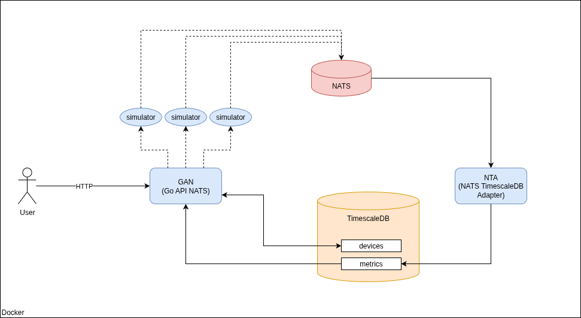

# go-nats-simulator

This repository contains a small microservices based architecture in Golang. The goal is to manage a network of IoT devices and simulate periodic sending of events for handling with NATS and TimescaleDB.

# Architecture and components



- **NATS**: NATS is a high-performance, lightweight messaging system designed for cloud-native applications, microservices, and IoT. It provides publish/subscribe, request/reply, and streaming communication patterns with minimal latency and overhead. NATS is known for its simplicity, scalability, and fault tolerance, making it ideal for distributed systems that need fast, reliable message delivery.

- **TimescaleDB**: TimescaleDB is an open-source time-series database built on top of PostgreSQL. It’s optimized for storing and querying large volumes of time-stamped data—such as metrics, events, or IoT readings—while retaining full SQL compatibility. TimescaleDB extends PostgreSQL with features like hypertables, automatic data partitioning, and continuous aggregates, offering both scalability and high performance for time-series analytics.

- **GAN (Go API NATS)**: Golang service which contains the API to manage the sensors and get their samples.

- **NTA (NATS TimescaleDB Adapter)**: Golang service which consumes from NATS topic metrics and insert the data in TimescaleDB.

## Try out

To run the architecture, a bash script has been developed: *setup.sh*. Please, execute this commands in the project root directory:

```bash
 chmod +x setup.sh
./setup.sh
```

Later, you can monitoring the containers with the following command:

```bash
 docker logs <container_name> -f
```

For adding your first sensor, use the API. For example:

```bash
curl -X POST "http://localhost:8080/api/v1/sensors" \
    -H 'Content-Type: application/json' \
    -d '{"Id":"8cf3030f-2206-4fcb-8c42-d0eb70e197ab", "type":"temperature", "alias":"sensor_1", "rate": 6, "maxThreshold":40.0, "minThreshold":-20}' -i
```

To consume from NATS in your console, execute (natsio/nats-box must be installed):

```bash
 docker run --rm -it --network go-nats-simulator_default natsio/nats-box nats sub -s nats://nats:4222 sensors
```

For singing in TimescaleDB:

```bash
 docker exec -it timescale-db psql -U admin -d sensors
```

## API documentation

In the path go-nats-simulator/doc/api there is an openapi.yml file with the API specifications.

## Improvements lines

- Discard outrange metric values.
- Add repository tests.
- Develop NTA as a complete service with hexagonal architecture for scalability.
- Develop a script which delete old metrics data periodically.